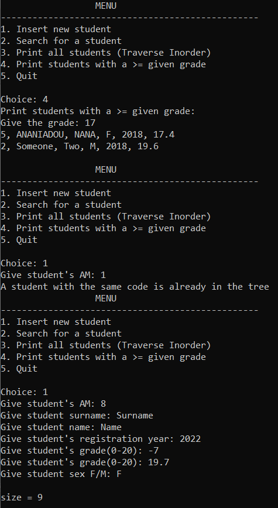
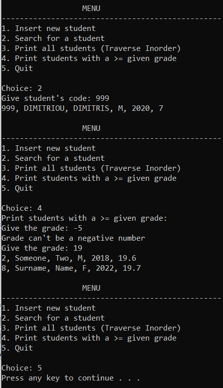
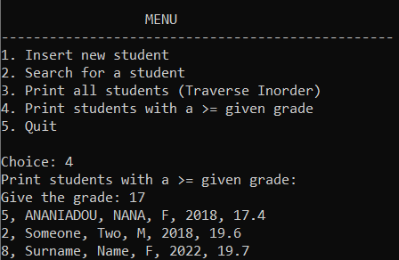
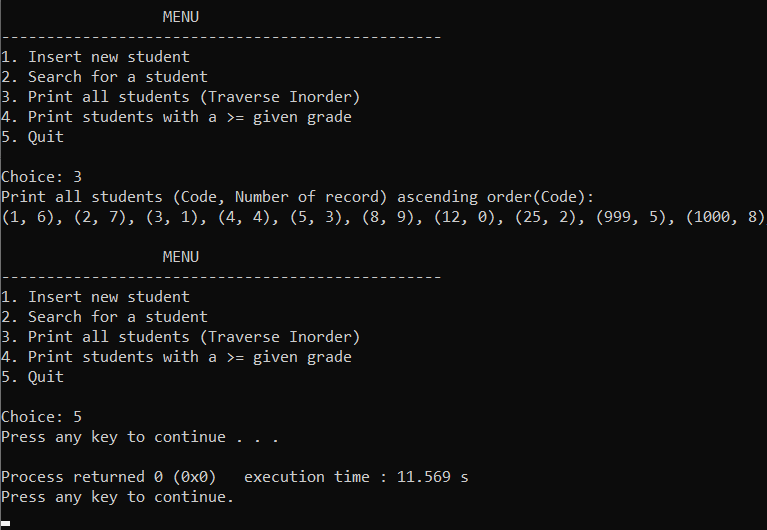

# School-Student-Management
## Explanation
A Management System for the __*Students*__ of a school. 

Features:

- Add new students
- Search for specific students
- Search for the students with a grade greater than the one you will give as an input 
- See all the records of the students in order

## Screenshots

 &nbsp; &nbsp; &nbsp; &nbsp; &nbsp;

&nbsp; &nbsp; &nbsp; &nbsp; &nbsp; &nbsp; &nbsp; &nbsp; &nbsp; &nbsp; &nbsp; &nbsp; &nbsp; &nbsp; &nbsp; &nbsp; &nbsp; &nbsp; ⬇️⬇️⬇️

 &nbsp; &nbsp; &nbsp; 
